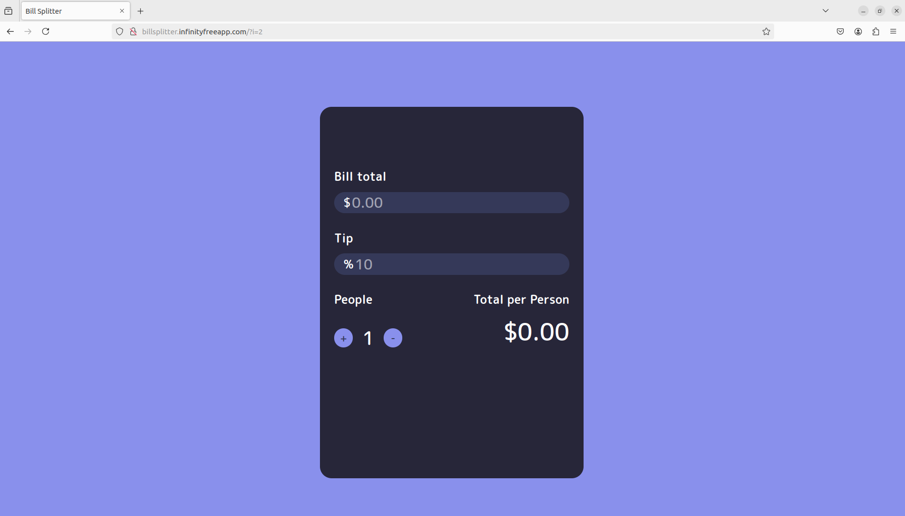
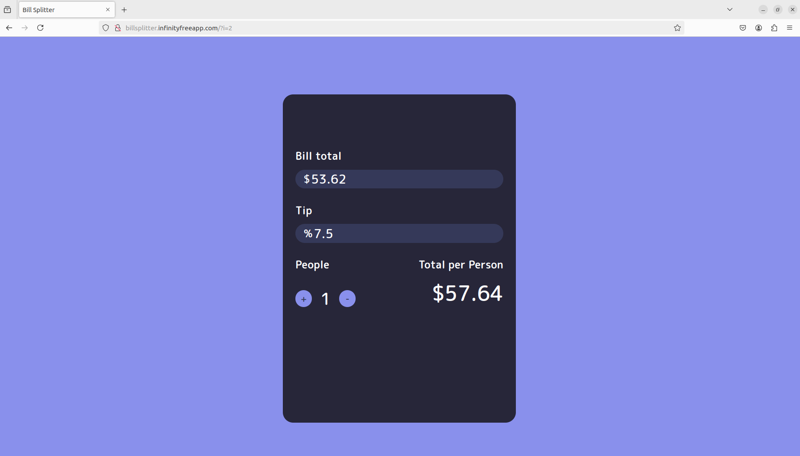
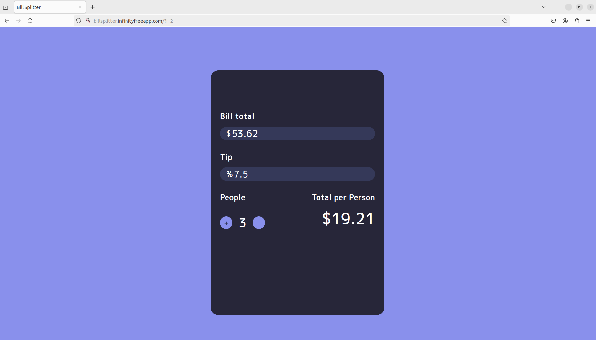

## Description

--> Designed a bill splitter web application using JavaScript, HTML and CSS.

--> When the user enters the total bill amount, the tip percentage and the number of people sharing the bill, the calculator dynamically displays the amount to be paid by each person after each keystroke.

## UI Snapshots
## Snapshot1

## Snapshot2

## Snapshot3

## Snapshot4

